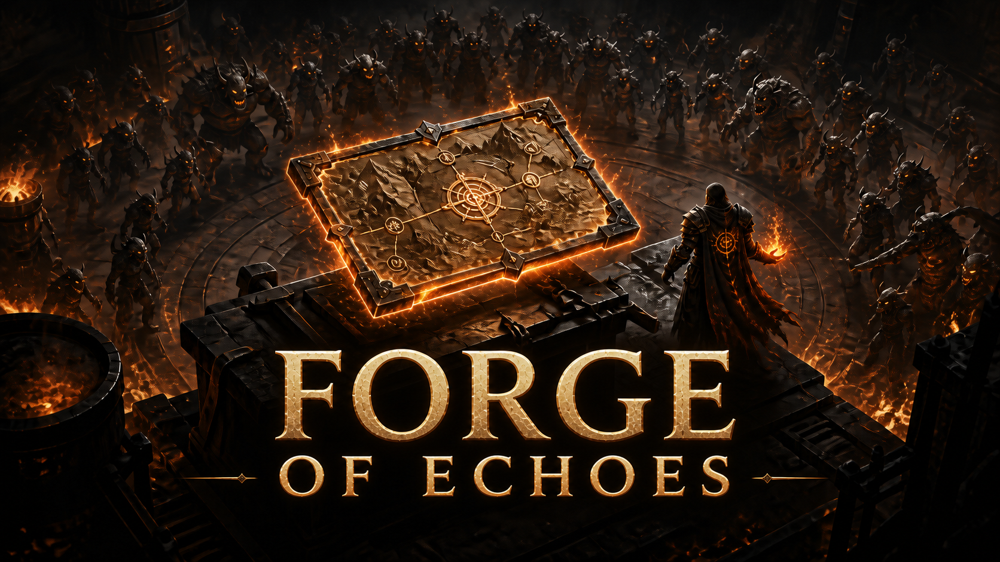

<p align="center">
  
</p>

<h1 align="center">Forge of Echoes</h1>

<p align="center">
  <strong>Forge your build. Break the waves. Claim what survives.</strong>
</p>

<p align="center">
  A browser-native, multiplayer pixel-art action RPG built around deep itemization,<br />
  dangerous map items, dense monster waves, and hands-on crafting.
</p>

<p align="center">
  <a href="https://discord.gg/avMe75Xaf"></a>
  
  
</p>

> [!NOTE]
> Forge of Echoes is in active development. The Sorceress is currently the playable class; more classes, skills, monsters, items, and crafting options will follow as the core game matures.

## Enter the Forge

Forge of Echoes combines the build depth of classic loot-driven ARPGs with a focused wave-based endgame. Every character, item, map, monster, drop, and combat result is managed by an authoritative multiplayer server—even when playing solo.

Your hideout is the heart of the game. Prepare your equipment, organize your stash, trade with other players, craft map items, and open six portals into increasingly dangerous expeditions. Inside, explore a large scrolling battlefield, fight distributed monster packs through six escalating waves, collect shared free-for-all loot, and survive the final rage.

## Current highlights

| | Feature |
|---|---|
| ⚔️ | Fast pixel-art combat with directional animation, projectiles, damage numbers, positional audio, corpses, and dense monster packs |
| 🔥 | A playable Sorceress with configurable skill slots, skill levels, casting, cooldowns, charges, projectiles, and piercing |
| 💎 | Normal, magic, and rare equipment with item levels, base stats, affix tiers, roll ranges, implicits, and rarity-colored loot |
| 🔨 | Inventory crafting inspired by currency-based ARPG systems: activate a material, then apply it directly to an eligible item |
| 🗺️ | Maps are real items that can be bought, found, crafted, consumed, and opened through a six-portal map device |
| 👹 | Melee, ranged, jumping, fast, tanky, magic, and rare monsters assembled into randomized packs and escalating waves |
| 🧙 | Character levels 1–99, experience, attributes, derived combat stats, equipment comparison, and persistent skill progression |
| 🎒 | Grid-based backpack and multi-tab stash with item footprints, drag-and-drop placement, quick transfers, equipment slots, and flask belt |
| 🤝 | One-to-four-player parties, shared hideouts, co-op maps, transactional trading, and first-come-first-served loot |
| 🛡️ | Server-authoritative combat, progression, inventory, map state, drops, and trades—clients send intent, never trusted outcomes |

## The current game loop

1. Enter your account name and select or create a uniquely named Sorceress.
2. Prepare your character in the hideout using the inventory, stash, merchant, and skill interfaces.
3. Buy or find a map, craft it in your backpack, and place it into the map device.
4. Open six one-use portals and enter alone or with a party of up to four players.
5. Hunt geographically distributed packs through six increasingly dangerous waves.
6. Collect equipment, maps, flasks, and crafting materials directly from the ground.
7. Defeat the final rage, open the reward chest, return to the hideout, and improve your build.

There are no temporary between-wave power-ups. Progress comes from your character level, attributes, skills, equipment, and crafting decisions.

## Controls

| Input | Action |
|---|---|
| `W` `A` `S` `D` | Move |
| Left click | Aim and use the primary attack |
| `Space` `Q` `E` `R` `F` | Use configured skills |
| `1`–`5` | Use flask-belt slots |
| `I` | Open or close the inventory |
| `Alt` / `Option` | Show affix ranges and equipped-item comparisons |
| `Ctrl` / `⌘` + click | Contextual quick transfer, equip, load, or buy |
| Right click | Activate a crafting material |

Skill slots are configurable. The displayed hotkeys always reflect the current loadout.

## Run it locally

### Requirements

- Node.js 22.13 or newer
- Docker Desktop with Docker Compose
- npm

### Start the complete development stack

```bash
git clone https://github.com/sharenz/crafty-combat.git
cd crafty-combat
npm install
npm run dev
```

Open [http://localhost:3001](http://localhost:3001). The development command starts:

- PostgreSQL in Docker on `127.0.0.1:5434`
- the authoritative game server on `127.0.0.1:2567`
- the web client on `127.0.0.1:3001`

Local development is entirely self-contained. Copy `.env.example` to `.env` only when you need to override the safe defaults.

```bash
npm run db:down       # Stop the local PostgreSQL container
npm run dev:web       # Start only the web client
npm run dev:server    # Start only the game server
```

## Quality gates

```bash
npm run typecheck
npm run lint
npm test
npm run test:multiplayer:db
```

The test suite covers the game engine, authoritative profile commands, real WebSocket rooms, four-player party and map flows, forged-command rejection, free-for-all loot, item ownership, trading, persistence, simulation performance, production builds, and server-rendered metadata.

## Architecture at a glance

```text
Browser / React UI / Phaser renderer
                │
                │ validated player intent
                ▼
      Colyseus authoritative rooms
                │
       game services + simulation
                │
                ▼
     PostgreSQL persistence and coordination
```

- `app/game/` — serializable domain models, stats, items, crafting, maps, loot, and balance configuration
- `app/game2d/` — Phaser presentation, interpolation, input, animation, VFX, and audio
- `app/components/` — React shell, HUD, inventory, stash, merchants, map device, and character interfaces
- `multiplayer/` — runtime-validated protocol contracts and compact wire formats shared by client and server
- `server/rooms/` — authoritative hideout and map rooms running the 20 Hz simulation
- `server/coordination/` — PostgreSQL-backed parties, expeditions, portals, leases, and room claims
- `server/db/migrations/` — ordered transactional schema migrations and relational ownership constraints
- `tests/` — engine, multiplayer, persistence, performance, rendering, and end-to-end coverage

The browser never creates items or decides damage, drops, cooldowns, ownership, experience, or progression. Solo and co-op use the same server rooms and commands, preventing a separate offline ruleset from drifting away from multiplayer.

Read the deeper technical documents:

- [Architecture](./ARCHITECTURE.md)
- [Game design foundation](./GAME_DESIGN.md)
- [Server scaling](./SERVER_SCALING.md)
- [Production deployment](./DEPLOYMENT.md)

## Production and administration

Production runs the web client, authoritative Node/Colyseus server, and PostgreSQL as an isolated Docker Compose stack on one VM. Deployment remains intentionally simple:

```bash
make deploy
```

Realm administration is available through the interactive terminal console:

```bash
npm link
crafty-cli dev
crafty-cli prod
```

See [DEPLOYMENT.md](./DEPLOYMENT.md) before provisioning or deploying a server.

## Community

Forge of Echoes is being built in the open, one system at a time. Join the community to share feedback, report bugs, discuss builds, or follow development:

### [Join the Forge of Echoes Discord →](https://discord.gg/avMe75Xaf)

When reporting a bug, please include what you were doing, whether you were playing solo or in a party, and any relevant browser or server logs. Focused reproduction steps are extremely valuable for an authoritative multiplayer game.

---

<p align="center">
  <strong>The forge remembers every choice.</strong><br />
  What will your echoes become?
</p>
